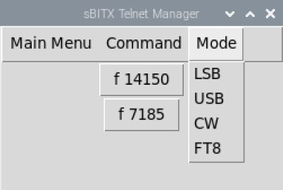

sBITX Telnet Manager
--------------------------------

sBITX Telnet Manager is a companion app that provides additional control for the sBITX HF transceiver. This tool uses the telnet protocol interface to send commands to the sBITX for performing remote control of the tranceiver.




Usage
-----

You just need to download and run ```sBITX_manager.py``` or clone the repository.

Right click on the frequency buttons to edit or remove them. The format for frequencies is ```f xxxx``` where xxxx is the frequency
such as ```f 14285```

You can also add other commands other than frequencies such as agc, step, drive, audio, rit, split, span, qrz, clear. and more.

You must open a telnet session from the menu before sending commands to the sBITX. The sBITX app must be running on your tranceiver before using the sBITX manager.

You can use this app locally on your sBitx or on a remote computer connected to the same network.

Install on you sBITX using terminal:


SBITX OR LINUX INSTALL
```
git clone https://github.com/drexjj/sBITX-Manager.git

cd sBITX-Manager

chmod +x ./sBITX_manager.py

./sBITX_manager.py

```

A file named `button_config.json` will be created on first use and stored in the directory of the script.
