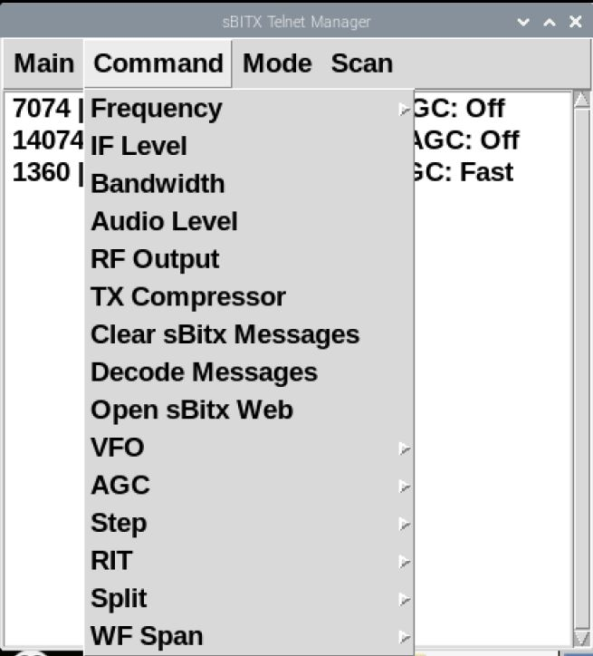

sBITX Manager v2.0
--------------------------------

sBITX Manager is a companion app that provides additional control for the sBITX HF transceiver using the telnet protocol. 

Here is a list of features:
- Provides a user-friendly interface for interacting with the sBITX transceiver
- Frequency memory management allows for adding, editing, and removal of frequencies and settings
- A memory scan function that scans through the list of stored frequencies at a customized interval
- Sends command specifying details such as VFO, Step, Mode, Bandwidth, IF, AGC, Audio, and more
- Decodes messages in FT8 and CW modes
- Text adjustment for better readabilitiy on larger screens
- Configuration is stored in a file, enabling easy transfer between devices and eliminating the need for manual entry of new memories





Installation
-----

You can either download and run ```sBITX_manager.py``` or clone the repository.

Install on you sBITX using terminal:
```
git clone https://github.com/drexjj/sBITX-Manager.git

cd sBITX-Manager

chmod +x ./sBITX_manager.py

./sBITX_manager.py

```

Windows Install:
```
Ensure Python version 3 is installed and configured on your computer

On the GitHub page, Select Code and Download the zip file

Extract the zip file on your computer

Double-click sBITX_manager.py
```

A file named `sbmanager_config.json` will be created on first use and stored in the directory of the script.


Usage
-----

You must open the telnet session from the menu before sending commands to the sBITX. The sBITX app must be running on your tranceiver before using the sBITX manager.

You can use this app locally on your sBitx or on a remote computer connected to the same network.

A USB eyboard and mouse are required to add or edit frequencies on the sBitx
